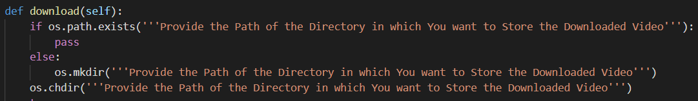
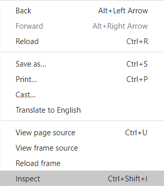
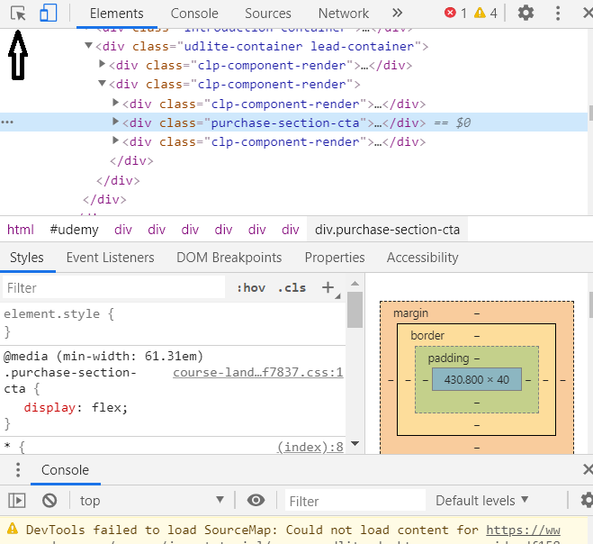
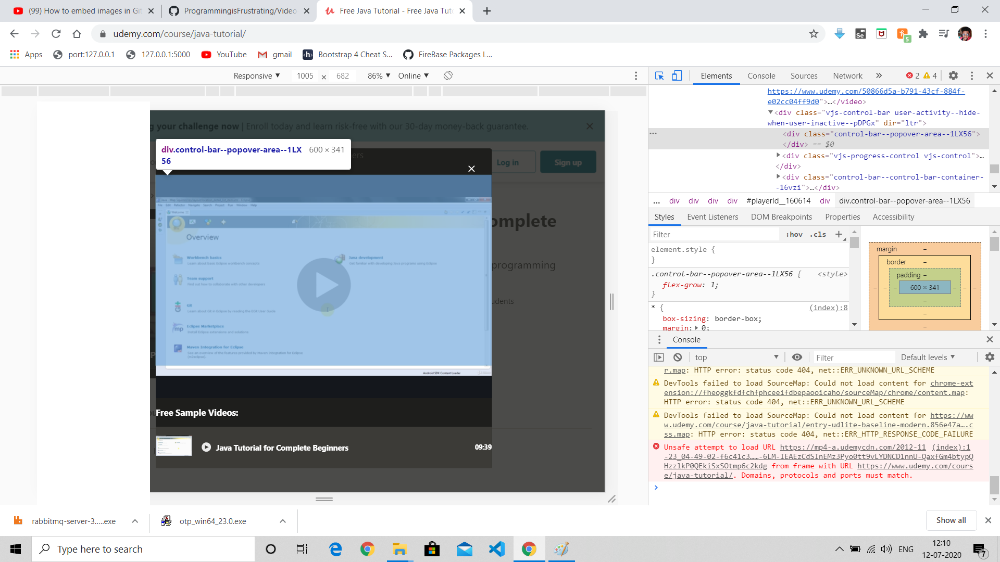
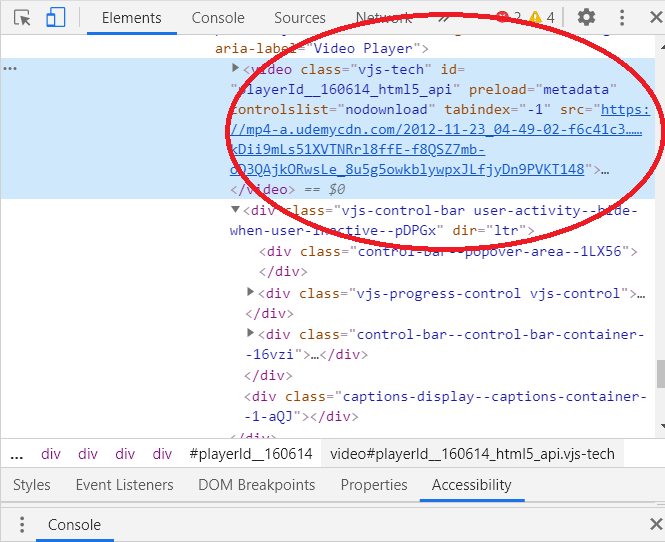
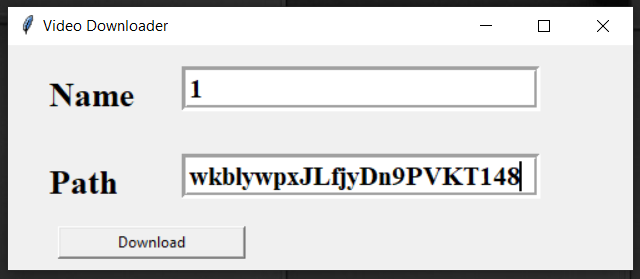
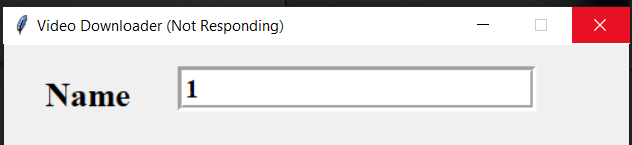
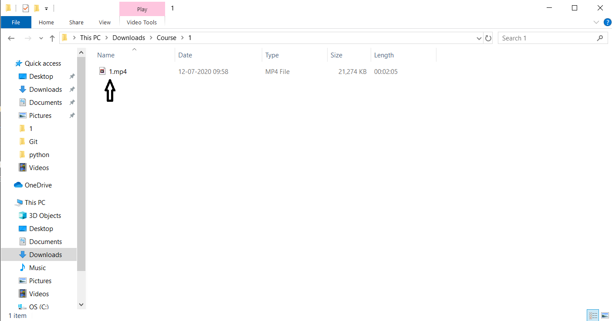

# Video-Downloading-GUI
## Note: This Wont Work For Youtube Videos
### Step 1:
#### Provide The Path of Directory Where You want the download the Video

### Step 2:
#### Go to the Website from where you want to download the video and right click on the page and press inspect

### Step 3:
#### Then Click on the small Arrow Icon on Element page

### Step 4:
#### Click on the Video which you want to Download

### Step 5:
#### You will find the URL Line for the Video Copy the URL

### Step 6:
#### Paste the URL in the path field and Specify a Name for the Video

### Step 7:
#### Dont Worry if the GUI is (Not Responding) if is downloading the file in the Background

### Step 8:
#### After the download is Complete a pop-up will pop saying that your Download is Successfull and ur video will be found in the Directory where u Specify the path

